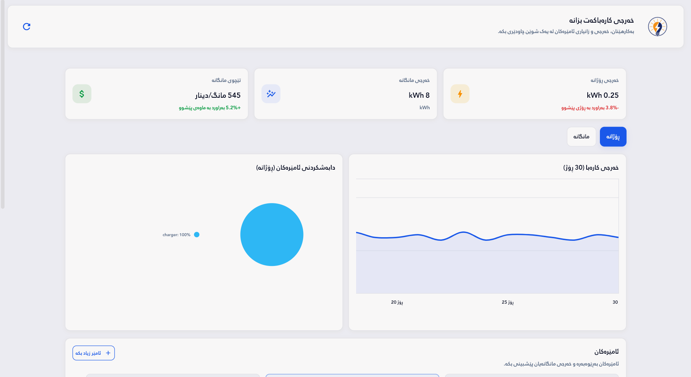
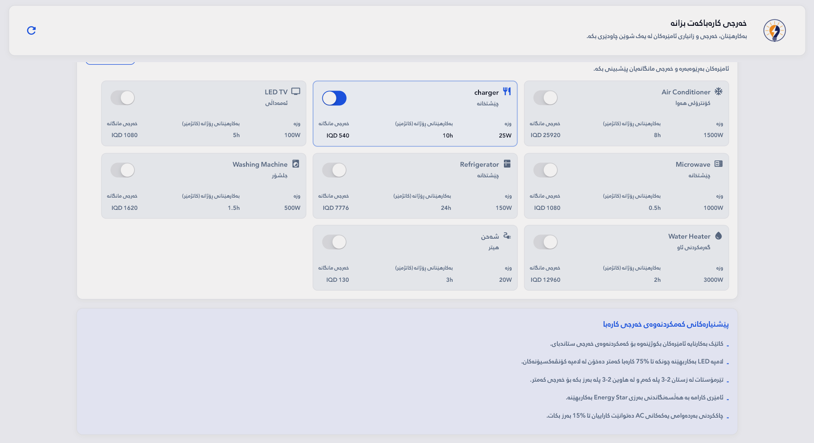
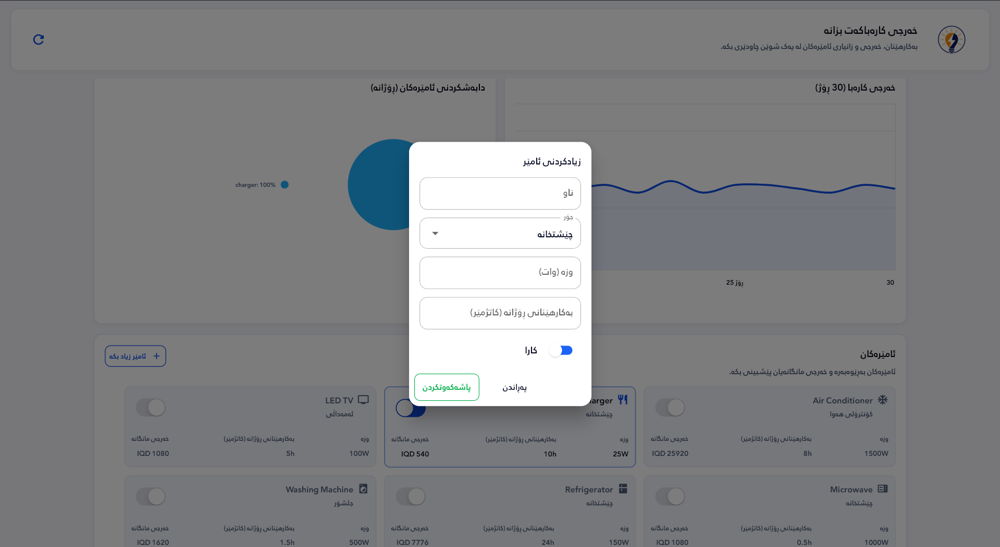
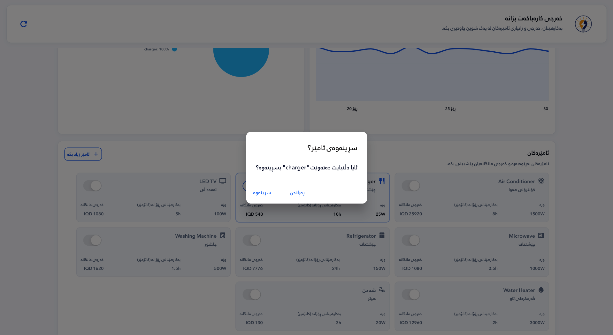
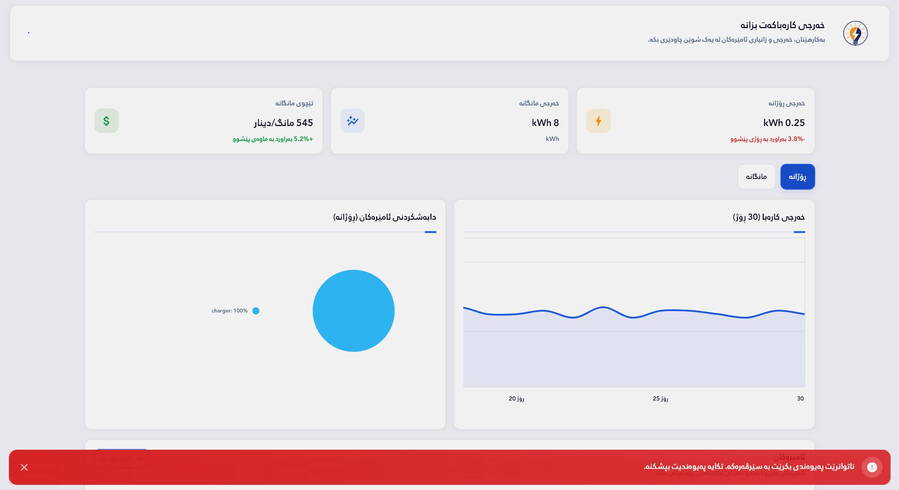
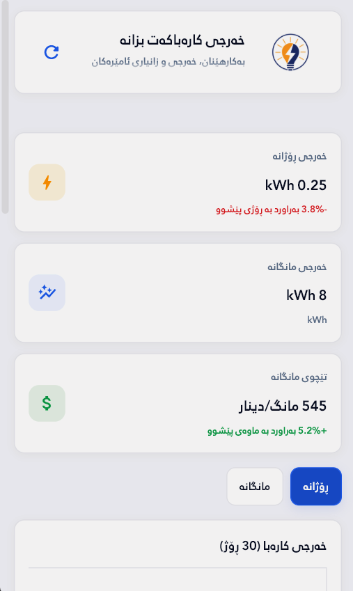
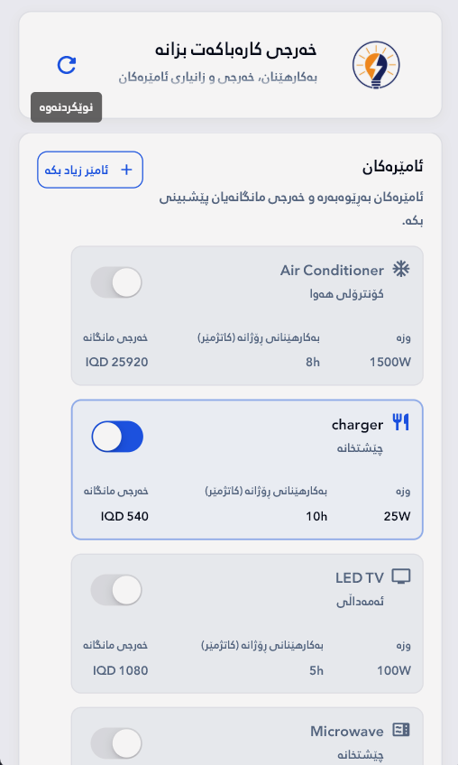

# Home Electricity Consumption Tracker

Flutter + Laravel app for tracking household electricity usage, estimating costs with progressive IQD tariffs, and managing appliances from a single dashboard.


## Highlights
- Daily and monthly consumption metrics with cost estimates
- Appliance management (add, edit, delete, toggle)
- Line chart trends and appliance breakdown pie chart
- Connectivity-aware actions with status feedback
- RTL-first UI with Kurdish (ckb) and English support

## Screenshots
<table>
  <tr>
    <td align="center">
      
      <br/>Dashboard overview
    </td>
    <td align="center">
      
      <br/>Appliances grid
    </td>
    <td align="center">
      
      <br/>Add appliance dialog
    </td>
  </tr>
  <tr>
    <td align="center">
      
      <br/>Delete appliance confirmation
    </td>
    <td align="center">
      
      <br/>Offline error snackbar
    </td>
    <td align="center">
      
      <br/>Mobile dashboard
    </td>
  </tr>
  <tr>
    <td align="center">
      
      <br/>Mobile appliances list
    </td>
  </tr>
</table>

## Tech Stack
**Frontend**
- Flutter, Dart
- Riverpod (state), GoRouter (navigation)
- Dio (HTTP), fl_chart (charts)

**Backend**
- Laravel 12 REST API
- MySQL

## Project Structure
- `backend/` Laravel API
- `frontend/` Flutter app
- `screenshots/` README assets

## Getting Started

### Backend (Laravel)
1) Copy `.env.example` to `.env` and set MySQL credentials:
```
DB_CONNECTION=mysql
DB_HOST=127.0.0.1
DB_PORT=3306
DB_DATABASE=home_electricity
DB_USERNAME=your_user
DB_PASSWORD=your_pass
```
2) Install dependencies:
```
composer install
```
3) Generate app key (if not set):
```
php artisan key:generate
```
4) Migrate & seed (tariff tiers, default appliances, 30 days usage logs):
```
php artisan migrate:fresh --seed
```
5) Run the API:
```
php artisan serve --port=8000
```

### Frontend (Flutter)
1) Install packages:
```
cd frontend
flutter pub get
```
2) If running on a physical device, set the API base URL in:
`frontend/lib/core/config/app_config.dart`
3) Run the app:
```
flutter run
```

## Tariff Logic (IQD per kWh)
- 1-400: 72
- 401-800: 108
- 801-1200: 175
- 1201-1600: 265
- 1601+: 350

## API Reference
See `backend/README.md` for full endpoint details and sample requests.
