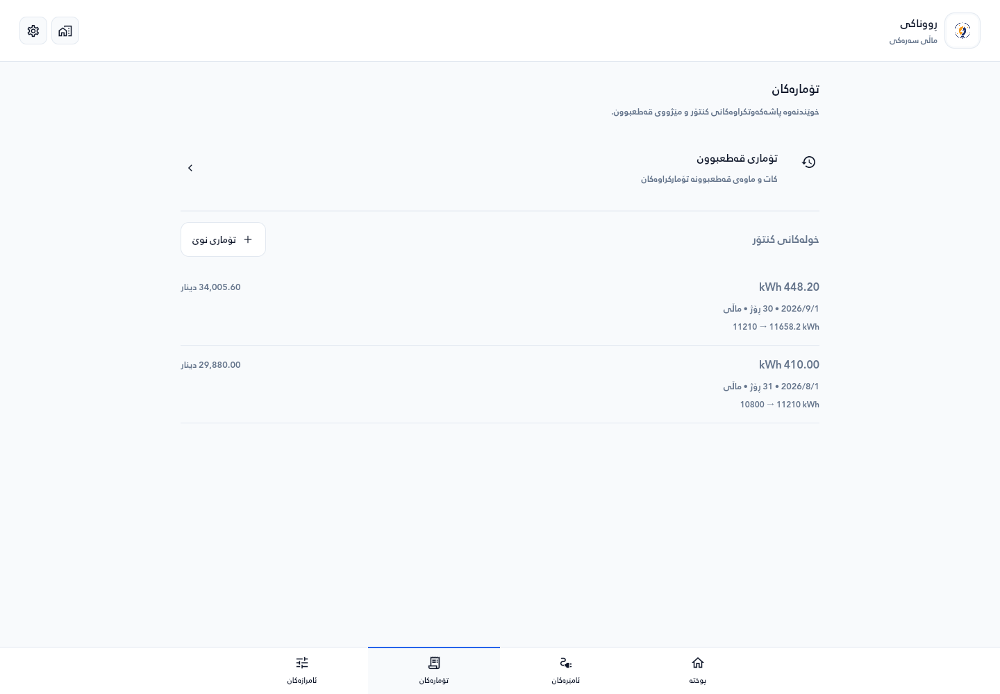
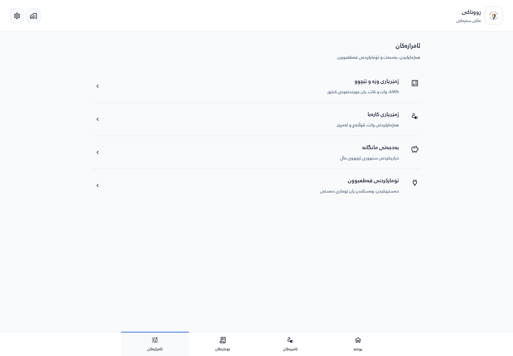
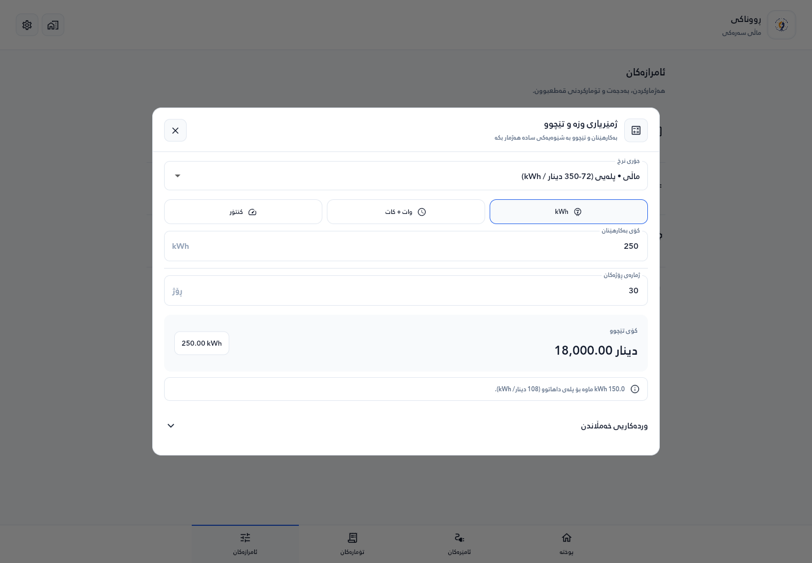

# Home Electricity Consumption Tracker

A standalone Flutter app for tracking household electricity usage, estimating costs with progressive IQD tariffs, and managing appliances. Data and calculations stay on the device; no server, API, or database hosting is required.


## Highlights

- Responsive light UI with Overview, Appliances, Records, and Tools navigation
- Daily and monthly consumption metrics with cost estimates
- Appliance management (add, edit, delete, toggle)
- Line chart trends and appliance breakdown pie chart
- Energy and electrical calculators, saved meter readings, and outage records
- Local storage for household profiles, appliances, budgets, and records
- Daily local reminder notifications
- Outage-aware billing (set outage minutes and auto-adjust cost/kWh)
- RTL-first UI with Kurdish (ckb) and English support
- Runs locally without a server or domain

## Screenshots

Captured from the current Flutter web app using illustrative sample data at desktop (1440 × 1000) and mobile (390 × 844) viewport sizes.

<table>
  <tr>
    <td align="center">
      
      <br/>Overview — consumption and cost estimates
    </td>
    <td align="center">
      
      <br/>Appliances — household devices and usage
    </td>
  </tr>
  <tr>
    <td align="center">
      
      <br/>Records — meter readings and outage history
    </td>
    <td align="center">
      
      <br/>Tools — calculators, budget, and outage tracking
    </td>
  </tr>
  <tr>
    <td align="center">
      
      <br/>Energy and cost calculator
    </td>
    <td align="center">
      
      <br/>Add an appliance
    </td>
  </tr>
  <tr>
    <td align="center">
      
      <br/>Mobile web overview
    </td>
    <td align="center">
      
      <br/>Mobile web appliances
    </td>
  </tr>
</table>

## Tech Stack

- Flutter, Dart
- Riverpod (state), GoRouter (navigation)
- SQLite (`sqflite`) for appliance and outage data on Android, iOS, and macOS
- Shared preferences for settings and local storage on web, Windows, and Linux
- fl_chart for consumption estimates and appliance breakdowns

## Project Structure

- `frontend/` standalone Flutter app
- `screenshots/` README assets

## Getting Started

Install Flutter, then run:

```bash
cd frontend
flutter pub get
flutter run
```

No `.env` file or server setup is needed. See [Local data and release builds](frontend/README_LOCAL_DATA.md) for storage details and Android release instructions.

## Checks

From `frontend/`:

```bash
flutter analyze
flutter test
```

## Tariff Logic (IQD per kWh)

- 1-400: 72
- 401-800: 108
- 801-1200: 175
- 1201-1600: 265
- 1601+: 350
